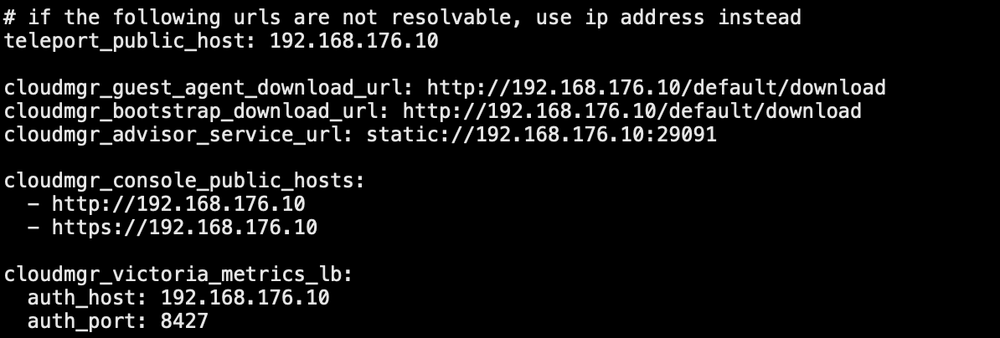
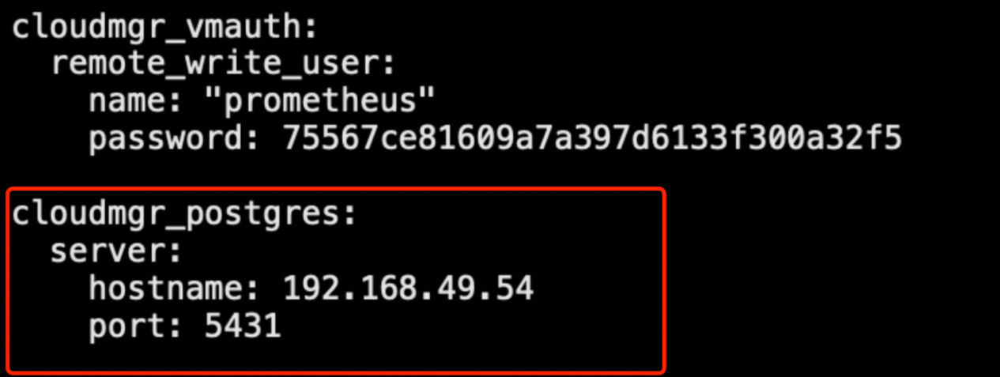
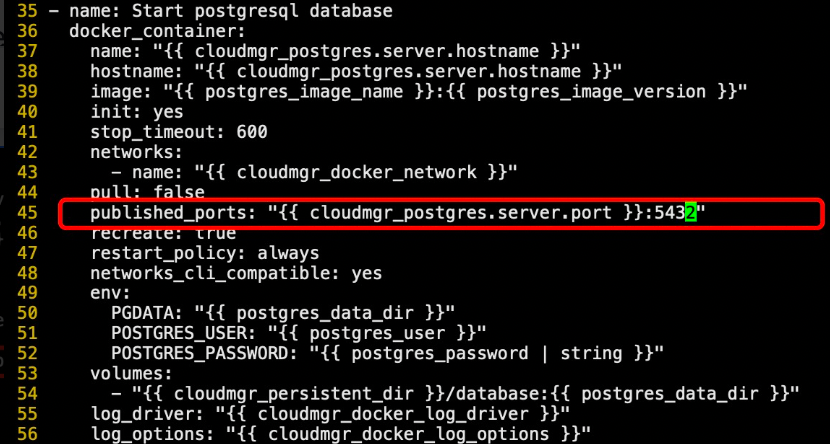
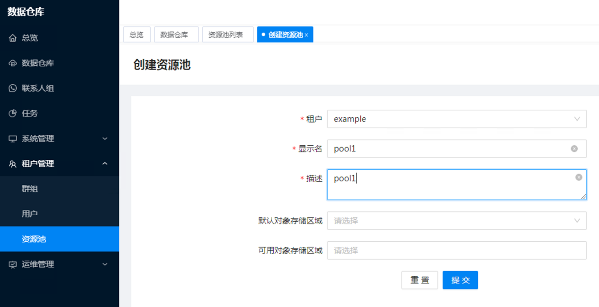
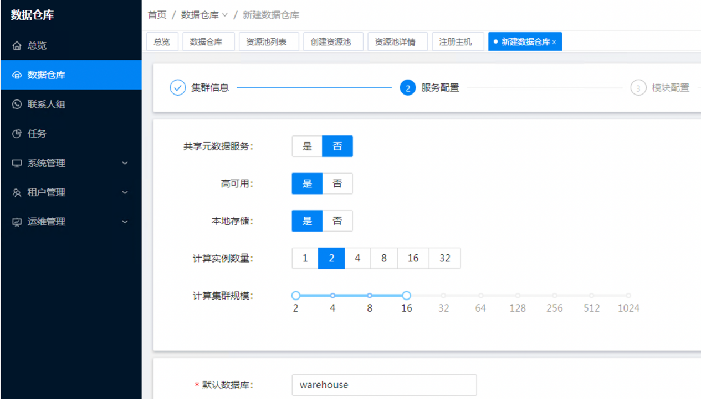
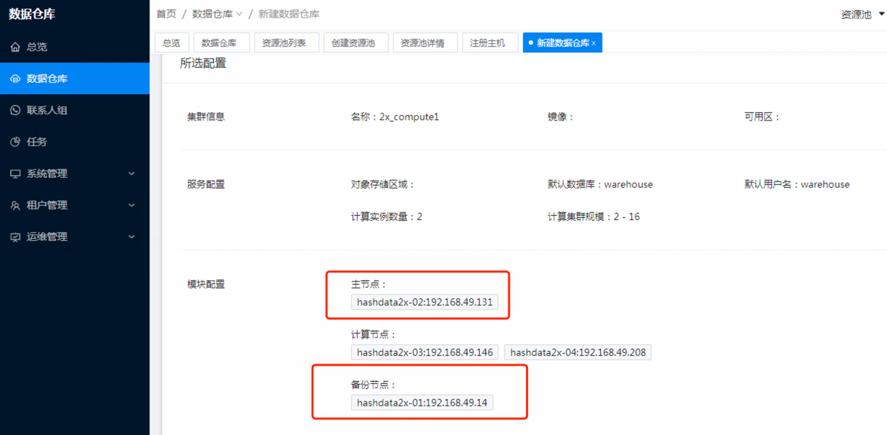

# Cloudberry Database部署手册

## Cloudberry Database系统架构

Cloudberry Database是一种大规模并行处理（MPP）数据库服务器，其架构特别针对管理大规模分析型数据仓库以及商业智能工作负载而设计。

MPP（也被称为 shared nothing 架构）指有两个或者更多个处理器协同执行一个操作的系统，每一个处理器都有其自己的内存、操作系统和磁盘。Cloudberry Database使用这种高性能系统架构来分布数 TB/PB 级数据仓库的负载并且能够使用系统的所有资源并行处理一个查询。

Cloudberry Database 是在 PostgreSQL 和 Greenplum Database 的基础上对系统架构和运行实现上面进行了大量深度的优化。但在查询接口（包括使用习惯）以及底层数据文件存储格式和访问协议方面，我们保持与开源系统一致。这一方面意味着用户可以充分利用已有的 SQL 技能和在 BI 和 ETL 工具方面的投入；另一方面意味着使用 Cloudberry Database完全没有应用和数据绑架的风险。


Cloudberry Database整套系统包含的组件如下：

<table>
<thead>
  <tr>
    <th>组件缩写</th>
    <th>子组件名称</th>
    <th>备注</th>
  </tr>
</thead>
<tbody>
  <tr>
    <td rowspan="2">计算集群</td>
    <td>控制节点 (Master/Standby)</td>
    <td>保存元数据，负责管理会话，SQL 解析及执行计划、分发 SQL，返回 SQL执行结果。</td>
  </tr>
  <tr>
    <td>Segment 计算节点</td>
    <td>保存用户数据，SQL 执行。</td>
  </tr>
  <tr>
    <td rowspan="4">CloudMgr 云管平台</td>
    <td>监控运维组件</td>
    <td>包含：ops/VictoriaMetrics/prometheus/grafana</td>
  </tr>
  <tr>
    <td>核心管理组件</td>
    <td>包含：Account/advisor/region/teleport/webGateway</td>
  </tr>
  <tr>
    <td>公共服务</td>
    <td>包含：Eureka/config 服务</td>
  </tr>
  <tr>
    <td>存储层</td>
    <td>持久化存储层：Postgres/etcd</td>
  </tr>
</tbody>
</table>

> **注意：**
>
> CloudMgr 云管平台为容器化部署。

## 硬件需求

Cloudberry Database支持 Intel_X86、海光_X86、ARM_鲲鹏等架构的物理服务器。

主机数量需求参考下表：

|  组件   |    最小主机数量    |  高可用部署主机数  |
|   :---|  :---   |      :----|
|  管理控制台  |  1   |   3 到 6（3 活部署）   |
|  计算集群   |  3  |  最少 4 个   |

ARM_鲲鹏生产环境推荐的物理机配置：

| 资源类型 | 规格                                     |
| :-------- | :---------------------------------------- |
| CPU      | 2 \* 鲲鹏 920<br />32 核 \* 2 物理线程   |
| 内存     | 256 GB                                   |
| 网络     | 10 Gbps 光交换以太网 \* 2<br />（bond 后使用） |
| 磁盘 1   | 480G SAS HDD \* 2 (RAID 1)<br />（系统盘）     |
| 磁盘 2   | 4T SAS HDD \* 8（RAID 5)<br />（数据盘）       |
| 阵列卡   | 支持 RAID 1、RAID 5、RAID 10             |

海光_X86 生产环境推荐的物理机配置：

| 资源类型 | 规格                                     |
| :-------- | :---------------------------------------- |
| CPU      | 2 \* HYGON 7390<br />32 核 \* 2 物理线程（双线程 128C）   |
| 内存     | 512 GB GB                                   |
| 网络     | 10 Gbps 光交换以太网 \* 2<br />（bond 后使用） |
| 磁盘 1   | 480G SAS HDD \* 2<br /> (RAID 1)（系统盘）     |
| 磁盘 2   | 4T SAS HDD \* 8<br />（RAID 5)（数据盘）       |
| 阵列卡   | 支持 RAID 1、RAID 5、RAID 10             |

Intel_X86 生产环境推荐的物理机配置：

| 资源类型 | 规格                                     |
| :-------- | :---------------------------------------- |
| CPU      | 2 \* HYGON 7390<br />32 核 \* 2 物理线程（双线程 128C）   |
| 内存     | 512 GB GB                                   |
| 网络     | 10 Gbps 光交换以太网 \* 2<br />（bond 后使用） |
| 磁盘 1   | 480G SAS HDD \* 2(RAID 1)<br />（系统盘）     |
| 磁盘 2   | 4T SAS HDD \* 8 (RAID 5)<br />（数据盘）       |
| 阵列卡   | 支持 RAID 1、RAID 5、RAID 10             |

### 存储需求

为了避免数据盘在高负载的情况下，影响操作系统正常的 IO 响应。操作系统应当与数据盘挂载到不同的磁盘上。在主机配置允许的情况下，建议使用 2 个独立的 SAS 磁盘作为系统盘(RAID1)，另外 10 块 SAS 磁盘作为数据盘 (RAID5)。建议使用 LVM 逻辑卷管理磁盘，以获取更灵活的磁盘配置。

#### 系统盘

系统盘应当使用独立的磁盘，以避免数据盘高负载时，影响操作系统的运行。建议系统盘为双盘 RAID 1 的配置，系统盘操作系统为 XFS。

#### 数据盘

建议使用 LVM 管理数据盘。经过测试，为每个物理卷创建一个独立的逻辑卷能获得最好的磁盘性能。示例如下：

```
pvcreate /dev/vdb
pvcreate /dev/vdc
pvcreate /dev/vdd
vgcreate data /dev/vdb /dev/vdc /dev/vdd
lvcreate --extents 100%pvs -n data0 data /dev/vdb
lvcreate --extents 100%pvs -n data1 data /dev/vdc
lvcreate --extents 100%pvs -n data2 data /dev/vdd
```

数据盘的挂载点应当为 `/data0`，`/data1` … `/dataN`。挂载点名称需要应当连续。数据盘应当使用 XFS 文件系统格式。示例如下：

```shell
mkdir -p /data0 /data1 /data2
mkfs.xfs /dev/data/data0
mkfs.xfs /dev/data/data1
mkfs.xfs /dev/data/data2
mount /dev/data/data0 /data0/
mount /dev/data/data1 /data1/
mount /dev/data/data2 /data2/
```

修改 `/etc/fstab` 文件，确保重启后数据盘能够正常挂载。

### 数据交换网络

#### 网卡配置

数据交换网络是用于业务数据传输的网络，对于网络性能和吞吐要求较高。生产环境一般需要两块 10 Gbps 网卡，bond 后作使用。Bond 4 参数建议如下：

```
BONDING_OPTS='mode=4 miimon=100 xmit_hash_policy=layer3+4'
```

#### 连通性要求

管理控制台与数据库主机应当在数据交换网络中连通，如果管理控制台与数据库主机的网络访问关系中有防火墙设备，应当确保 TCP 空闲连接能够保持 12 小时以上。

数据库主机之间、管理控制台主机之间，应当在数据交换网络中连通，且不应当限制TCP 空闲连接时间。

数据库客户端、访问数据库的应用程序应当与数据库主节点在数据交换网络中连通。应当确保 TCP 空闲连接能够保持 12 小时以上。

#### 默认网关

如果主机配置有管理网络，则应当使用数据交换网络的网卡 (bond0) 作为默认网关设备，否则可能导致主机网络流量监控异常、部署失败和性能问题。下面是一个查看默认网关的示例。

```shell
netstat -rn | grep ^0.0.0.0
```

#### 交换机

数据网络交换机的一层到二层的出口带宽不应当低于单机柜最大磁盘 I/O 吞吐能力（以单块 RAID 卡 500 MBps 计算）。建议交换机收敛比为 4:1。当收敛比达到 6:1 时，大多数链路会达到饱和。当收敛比达到 8:1 时开始出现显著丢包。

## 操作系统

### 操作系统版本

Cloudberry Database支持操作系统包括：KYLIN V10 SP1 或 SP2，中标麒麟 V7update6，RHEL/CentOS 7.6+，openEuler 20.3 LTS SP2 等。

### 操作系统配置

#### 主机名称配置

数据库和管理控制台对主机名称命名规则没有强制要求，但是需要满足以下条件：

- 必须是合法的主机名，不得包含非法字符。合法主机名字符包括英文字母、数字和连接符 `-`。下划线 `_` 不是合法字符。
- 主机名不区分大小写，建议全部使用小写字母。使用大写字母作为主机名，可能会导致 Kerberos 认证失败。
- 所有主机中，主机名必须唯一，并在 `/etc/hosts` 里写上所有机器。

#### 时间同步配置

应当为所有主机配置时间同步服务，时间同步服务应当随主机启动而启动。应当保证所有主机时间同步。

系统时区应当配置为客户所在时区。中国客户应当设置为东八区：

```
Asia/Shanghai East China – Beijing,Guangdong,Shanghai,etc.
```

#### SELinux 与防火墙配置

应当禁用防火墙和 SELinux 功能，示例如下：

```shell
systemctl stop firewalld
systemctl disable firewalld
setenforce 0
sed -i /etc/selinux/config -e 's/SELINUX=.*/SELINUX=disabled/g'
```

#### SSH 配置

SSH 服务端应当有以下配置（`/etc/ssh/sshd_config`）：

| 参数                     | 值    | 说明                                 |
| :------------------------ | :----- | :------------------------------------ |
| `Port`                   | `22`  | 监听端口                             |
| `PasswordAuthentication` | `yes` | 允许密码登录（集群初始化后可以变更） |
| `PermitEmptyPasswords`   | `no`  | 禁止空密码登录                       |
| `UseDNS`                 | `no`  | 不使用 DNS                           |

配置完成后执行 `systemctl restart sshd.service` 重启生效。

#### auditd 审计服务

启用 auditd 服务可能会带来性能问题，表现为主机内核 CPU 使用率接近 100%。

建议关闭 auditd 服务，示例如下：

```
auditctl -e0
systemctl disable auditd
```

#### 内核参数配置

内核参数是关系到数据库稳定运行的重要因素。管理控制台在初始化集群的时候会自动变更内核参数。因此请确认安装操作系统之后，没有人工设置过内核参数。

配置内核参数的脚本参见附件。

#### SSH 免密

CloudMgr 部署机到所有其他服务器需要配置 root 免密，示例如下：

```shell
ssh-keygen -t rsa
ssh-copy-id root@192.168.66.154
```

## 部署规划

| 机器名        | 虚拟机配置      | 操作系统        | 部署规划                         |
| ------------- | --------------- | --------------- | -------------------------------- |
| hashdata2x-01 | 8c/16G/50G/200G | 银河麒麟 V10SP2 | CloudMgr 管控与 Standby 混合部署 |
| hashdata2x-02 | 8c/16G/50G/200G | 银河麒麟 V10SP2 | Master                           |
| hashdata2x-03 | 8c/16G/50G/200G | 银河麒麟 V10SP2 | Segment                          |
| hashdata2x-04 | 8c/16G/50G/200G | 银河麒麟 V10SP2 | Segment                          |
| hashdata2x-05 | 8c/16G/50G/200G | 银河麒麟 V10SP2 | Segment                          |
| hashdata2x-06 | 8c/16G/50G/200G | 银河麒麟 V10SP2 | Segment                          |

对于物理机部署，建议采用 CloudMgr 管控与 Standby 混合部署，以节约资源。

## 介质准备

将以下 6 个介质下载存放至 CloudMgr 管控机器的 `/root/` 或者 `/data/` 下即可：

- CloudMgr-deploy 部署工具
- CloudMgr 容器镜像包
- CloudMgr-offline-repo 离线 yum 源
- cloudberry-db 安装包
- database-offline-repo yum 源
- JDK 1.8 介质

## 部署管理控制台

### 管理控制台架构

管理控制台由若干独立的服务组成，这些服务逻辑上可以分成非持久化存储层、持久化存储层、接入层、公共服务组件、核心管理组件和监控运维组件。

| 组件         | 说明                                                         |
| ------------ | ------------------------------------------------------------ |
| 非持久化存储 | 基于 Hazalcast 实现的分布式内存数据结构。提供分布式内存队列、消息队列和字典表结构实现，提供分布式锁实现。用于管理控制台中临时状态数据的存储。 |
| 持久化存储   | 基于 PostgreSQL 实现的一写多读高可用关系数据库存储系统。用于管理控制台中持久化数据的存储。 |
| 接入层       | 以 Nginx 实现的负载均衡和基于 Virtual IP Address 实现的高可用接入层。 |
| 公共服务组件 | 提供全局配置管理、服务注册和服务发现等功能。                 |
| 核心管理组件 | 管理控制台核心功能，管理数据库集群。                         |
| 监控运维组件 | 基于 Prometheus、Grafana 等实现的数据库集群监控和运维组件。实现数据库集群的性能、健康状态监控、展示和告警功能。 |

管理控制台采用 3 主机高可用部署。其中 PostgreSQL 采用一主两从的主从高可用架构，并通过 pgpool 实现自动高可用切换和负载均衡。其他控制台组件采用同构三副本多活架构实现高可用。

接入层通过 Nginx 实现四层负载均衡，并通过 VIP 对外提供稳定的接入点。管理控制台部署架构图如下。


## 第 1 步：准备离线安装环境

可以选择管理控制台的任意一台主机作为离线部署主机，或者使用独立的一台主机作为离线部署主机。部署主机对 CPU、内存等硬件资源没有要求，操作系统与其他主机相同。部署主机应当与其他主机在数据交换网络连通。

在部署主机（CloudMgr 节点）上，使用 root 用户完成以下操作。

1. 在 `/root` 目录下，解压以下安装包。

    ```shell
    tar -xzf cloudmgr-offline-repo.tar.gz
    tar -xzf cloudmgr-deploy.tar.gz
    ```

2. 准备管理控制台镜像文件。

    ```shell
    mkdir /root/cloudmgr-offline-repo/docker/cloudmgr
    cp cloudmgr-4.5.0-RELEASE-20210916.071152_x86_64.tar.gz /root/cloudmgr-offline-repo/docker/cloudmgr/
    ```

3. 启用离线安装服务。

    1. 修改 `/root/cloudmgr-offline-repo/bootstrap.sh`（只针对 Kylin v10 aarch64 操作系统，其它系统不需要）：

        把下图中第 46 行的 `/usr/bin/python3` 改成 `/usr/bin/python2`，把 51、52 行的 `pip` 改成 `pip2`。

        

    2. 执行以下命令：

        ```shell
        /root/cloudmgr-offline-repo/bootstrap.sh install
        ```

4. 检查服务是否自启动。

    ```shell
    systemctl status cloudmgr-repo
    ```

### 第 2 步：准备配置文件

1. 编辑 Ansible Hosts 文件。编辑文件 `/root/cloudmgr-deploy/profiles/xxx/hosts`，将文件中所有的 IP 修改为 CloudMgr 服务器的 IP。

2. 编辑全局配置文件。

    编辑文件 `/root/cloudmgr-deploy/profiles/xxx/group_vars/all.yml`，填入各个组件的默认密码、IP 等信息，参考如下：

    在第一行修改版本信息，按实际填写：

    ```
    cloudmgr_image_version: 4.16.0-SNAPSHOT-20220830.080339
    ```

    将所有 IP 替换为 CloudMgr 服务器的实际 IP：

    

### 第 3 步：CloudMgr 与 Standby 节点混部配置（可选）

CloudMgr 里 Postgres 容器端口会与 Master/Standby 缺省端口冲突（5432）。你可以在创建计算集群时指定 Master/Standby 端口。如果 Master/Standby 坚持使用 5432 端口，则需要修改 CloudMgr 里 Postgres 容器的服务端口映射关系，将 5432 修改为 5431。方法如下：

1. 修改 `/root/cloudmgr-deploy/profiles/standalone-offline example/group_vars/all.yml`，在最后添加下图中红色圈内的配置（IP 部分填写 CloudMgr 地址）：

    

2. 修改 `cloudmgr-deploy/roles/postgresql-standalone-role/tasks/main.yml` 中第 2 个 `cloudmgr_postgres.server.port` 为 `5432`，如下图所示：

    

### 第 4 步：部署依赖组件

在 `/root/cloudmgr-deploy/` 执行以下命令：

1. 初始化控制台主机。

    ```shell
    ansible-playbook -i profiles/xxx/hosts deploy-setup-hosts-playbook.yml
    ```

2. 部署 Docker 环境。

    ```shell
    ansible-playbook -i profiles/xxx/hosts deploy-setup-docker-playbook.yml
    ```

3. 部署 PostgreSQL 数据库。

    ```shell
    ansible-playbook -i profiles/xxx/hosts
    cleanup-deploy-postgresql-standalone-playbook.yml
    ```

4. 部署 Victoria Metrics。

    ```shell
    ansible-playbook -i profiles/xxx/hosts deploy-victoria-metrics-cluster-playbook.yml
    ```

5. 部署单节点 PostgreSQL。

    ```shell
    ansible-playbook -i profiles/xxx/hosts cleanup-deploy-postgresql-standalone-playbook.yml
    ```

### 第 5 步：部署管理控制台

1. （仅适用于麒麟 v10 操作系统）修改 `/usr/lib/systemd/system/docker.service`，在第 13 行的行尾添加：`--default-ulimit nofile=65536:65536`。

    

2. 重启 Docker 服务：

    ```shell
    systemctl daemon-reload
    systemctl restart docker
    ```

3. 在 `/root/cloudmgr-deploy/` 下执行以下命令：

```shell
ansible-playbook -i profiles/xxx/hosts deploy-cloudmgr-playbook.yml
```

通过以下命令检查管理控制台的部署情况，正常情况下所有容器应当处于运行状态：

```shell
docker ps -a | grep cloudmgr
```

## 部署数据库

### 第 1 步：准备离线安装环境

在部署主机上，使用 `root` 用户完成以下操作。

1. 在 `/root` 目录下解压以下安装包：

    ```shell
    tar -xzf database-offline-repo.tar.gz
    ```

2. 启用离线安装服务：

    ```shell
    /root/database-offline-repo/bootstrap.sh
    ```

3. 检查服务是否启动：

    ```shell
    systemctl status hashdata-repo
    ```

### 第 2 步：部署依赖组件

1. 编辑 `/root/database-offline-repo/ansible/hosts 文件`，在 `[database]` 部分填入所有数据库主机（Master/Standby/Segment）的 IP。因为当前为 CloudMgr 和 Standby 混合部署，所以你需要在 `[database]` 部分填入 CloudMgr 节点。

    

2. 在 `/root/database-offline-repo/ansible` 目录下执行以下命令：

    ```shell
    ansible-playbook -i hosts database-offline-setup-playbook.yml
    ```

### 第 3 步：创建 gpadmin 账号

> 注意：所有机器上 `gpadmin` 账号的 ID 需要使用 `1001`，CloudMgr 节点上的 Postgres 账号会使用 `1000`，以此避免冲突。

为每台机器创建 `gpadmin` 账号：

```shell
groupadd -g 1001 gpadmin
useradd -g 1001 -u 1001 -m -d /home/gpadmin -s /bin/bash gpadmin
echo "Qaz2wsx3edc" | passwd --stdin gpadmin
```

### 第 4 步：部署数据库软件

在所有数据库主机（Master/Standby/Segment）上，以 root 身份执行以下命令。可以借用 CloudMgr 机器上的 Ansible 脚本来批量执行。

```shell
cd /root/database-offline-repo/ansible/

ansible database -i ./hosts -m shell -a 'yum install -y apr apr-util bzip2 rsync zip curl libcurl libevent libxml2 libyaml zlib openldap openssh openssl openssl-libs perl readline sed krb5 krb5-devel zstd sshpass '

ansible database -i ./hosts -m copy -a 'src=/data0/cloudberry-db-1.2.0-1.el7.centos.x86_64.rpm dest=/data0/'

ansible database -i ./hosts -m shell -a 'yum install -y /data0/cloudberry-db-1.2.0-1.el7.centos.x86_64.rpm '

ansible database -i ./hosts -m shell -a 'chown -R gpadmin:gpadmin /usr/local/cloudberry-db'
ansible database -i ./hosts -m shell -a 'chown -R gpadmin:gpadmin /usr/local/cloudberry-db-1.* '

ansible database -i ./hosts -m shell -a 'ln -s /usr/local/cloudberry-db  /opt/gpsql'
ansible database -i ./hosts -m shell -a 'chown -R gpadmin:gpadmin
/opt/gpsql'
```

在 `/opt/gpsql/greenplum_path.sh` 中指定 `GPHOME`：

```shell
GPHOME=/opt/gpsql
export MASTER_DATA_DIRECTORY=/data0/database/master/gpseg-1/
export PGPORT=5432
```

在 `/home/gpadmin/.bashrc` 增加以下脚本：

```shell
test -f /opt/gpsql/greenplum_path.sh && . /opt/gpsql/greenplum_path.sh
```

### 第 5 步：配置 gpadmin 账号的 SSH 免密

1. 为每台机器生成密钥。

    ```shell
    su - gpadmin
    ssh-keygen -t rsa
    ```

2. 批量免密。

    ```shell
    gpssh-exkeys -f hostfile_exkeys
    ```

3. 在 `hostfile_exkeys` 文件中放入所有节点的主机名：

    ```shell
    cat hostfile_exkeys
    hashdata2x-01
    hashdata2x-02
    hashdata2x-03
    hashdata2x-04
    hashdata2x-05
    hashdata2x-06
    ```

### 第 6 步：安装 JDK 1.8（cloudmgr-guest-agent 依赖）

1. 下载 JDK 并传到计算集群所有节点的 `/data/` 路径下：

    ```shell
    cd /root/database-offline-repo/ansible/
    ansible -i hosts database -m shell -a ' mkdir -p  /opt/gpsql/ext/ '
    ansible -i hosts database -m shell -a ' tar -zxf /data/jdk1.8.0_291.tar.gz -C /opt/gpsql/ext/  '
    ansible database -i ./hosts -m shell -a 'ln -s /opt/gpsql/ext/jdk1.8.0_291   /opt/gpsql/ext/jdk'
    ansible database -i ./hosts -m shell -a 'chown -R gpadmin:gpadmin /opt/gpsql/ext'
    ```

2. 修改 `/opt/gpsql/greenplum_path.sh` 增加如下部分：

    ```shell
    setup JAVA_HOME

    if [ -x "${GPHOME}/ext/jdk/bin/java" ]; then
      JAVA_HOME="${GPHOME}/ext/jdk"
      PATH="${JAVA_HOME}/bin:${PATH}"
      LD_LIBRARY_PATH=${JAVA_HOME}/jre/lib/amd64/server:${LD_LIBRARY_PATH-}
      export LD_LIBRARY_PATH
      export JAVA_HOME
    fi
    ```

## 创建计算集群

### 第 1 步：开启 Cloudberry 集群创建功能

1. 在 CloudMgr 节点上，修改 `/data0/cloudmgr/data/etc/config/repo/default.yml` 文件，将文件中 `warehouse` 下的 `enabled` 值改为 `true`。

    

2. 重启 `region-default` 容器使配置生效：

    ```shell
    docker ps -a | grep region-default | awk '{print $1}' | xargs docker restart
    ```

### 第 2 步：创建资源池

在管理控制台页面 (`http://cloudmgrIP`) 进行操作，(缺省账户，密码为 root@exmaple.com/root)。

1. 创建资源池。

    打开**租户管理** -> **资源池**页面，创建新资源池，名称为 demo，对象存储区域留空即可。

    

2. 注册主机。

    在**资源池详情**页面，点击**注册**按钮，在注册对话框中，填入 root 密码以及所有数据库节点 IP，完成数据库主机注册。

### 第 3 步：创建 Cloudberry 计算集群

1. 点击左侧导航的**数据仓库**后，在页面中点击**新建数据仓库**。
2. 填写集群信息后，进行服务配置：

    

    - **共享元数据服务**：选择“否”。
    - **高可用**：选择“是”，表示启用镜像。
    - **本地存储**：选择“是”，表示数据都保存在每台主机的本地磁盘上。
    - **计算实例数量**：每个主机上的 Segment 数量，这个集群设置为 `2`。
    - **计算集群规模**：如果集群中一共有 8 个 Primary Segment，则选择 `8-64`，64 代表最多扩容至 32 个 Segment 实例。
    - **默认数据库**：指定想要创建出来的数据库名字，默认为 `warehouse`。
    - **默认用户名**：指定需要创建的数据库用户，默认为 `warehouse`。
    - **默认密码**：指定上面“默认用户”的密码。

3. 进行模块配置。

    选择 `hashdata2x-02` 作为 Master 主节点，`hashdata2x-01` 作为 Standby 备份节点，其余 `hashdata2x-03`、`hashdata2x-04`、`hashdata2x-05`、`hashdata2x-06` 这 4 台机器作为 Segment 计算节点。

    

    管控控制台会在后台初始化计算集群，在**计算集群详情**页面，点击**刷新**可以查看是否创建成功。当计算集群状态变更为**运行中**，则创建工作完成。

## 参考：内核参数调整脚本 (Ansible)

<details>
<summary>内核参数调整脚本 (Ansible)</summary>

```
---
- name: Set max_map_count
  sysctl:
    name: vm.max_map_count
    value: "262144"
    state: present
    reload: no

- name: Set kernel.shmmax
  sysctl:
    name: kernel.shmmax
    value: "500000000000"
    state: present
    reload: no

- name: Set kernel.shmmni
  sysctl:
    name: kernel.shmmni
    value: "4096"
    state: present
    reload: no

- name: Set kernel.shmall
  sysctl:
    name: kernel.shmall
    value: "4000000000"
    state: present
    reload: no

- name: Set kernel.sem
  sysctl:
    name: kernel.sem
    value: 250 512000 100 2048
    state: present
    reload: no

- name: Set kernel.sysrq
  sysctl:
    name: kernel.sysrq
    value: "1"
    state: present
    reload: no

- name: Set kernel.msgmnb
  sysctl:
    name: kernel.msgmnb
    value: "65535"
    state: present
    reload: no

- name: Set kernel.msgmax
  sysctl:
    name: kernel.msgmax
    value: "65535"
    state: present
    reload: no

- name: Set kernel.msgmni
  sysctl:
    name: kernel.msgmni
    value: "2048"
    state: present
    reload: no

- name: Set kernel.core_pattern
  sysctl:
    name: kernel.core_pattern
    value: "core-%e-%s-%u-%g-%p-%t"
    state: present
    reload: no

- name: Set net.ipv4.tcp_syncookies
  sysctl:
    name: net.ipv4.tcp_syncookies
    value: "1"
    state: present
    reload: no

- name: Set net.ipv4.tcp_syn_retries
  sysctl:
    name: net.ipv4.tcp_syn_retries
    value: "7"
    state: present
    reload: no

- name: Set net.ipv4.ip_forward
  sysctl:
    name: net.ipv4.ip_forward
    value: "1"
    state: present
    reload: no

- name: Set net.ipv4.conf.default.accept_source_route
  sysctl:
    name: net.ipv4.conf.default.accept_source_route
    value: "0"
    state: present
    reload: no

- name: Set net.ipv4.tcp_tw_recycle
  sysctl:
    name: net.ipv4.tcp_tw_recycle
    value: "0"
    state: present
    reload: no

- name: Set net.ipv4.tcp_tw_reuse
  sysctl:
    name: net.ipv4.tcp_tw_reuse
    value: "1"
    state: present
    reload: no

- name: Set net.ipv4.tcp_max_syn_backlog
  sysctl:
    name: net.ipv4.tcp_max_syn_backlog
    value: "4096"
    state: present
    reload: no

- name: Set net.ipv4.conf.all.arp_filter
  sysctl:
    name: net.ipv4.conf.all.arp_filter
    value: "1"
    state: present
    reload: no

- name: Set net.ipv4.ip_local_port_range
  sysctl:
    name: net.ipv4.ip_local_port_range
    value: 1025 65535
    state: present
    reload: no

- name: Set net.core.netdev_max_backlog
  sysctl:
    name: net.core.netdev_max_backlog
    value: "10000"
    state: present
    reload: no

- name: Set net.core.rmem_max
  sysctl:
    name: net.core.rmem_max
    value: "2097152"
    state: present
    reload: no

- name: Set net.core.wmem_max
  sysctl:
    name: net.core.wmem_max
    value: "2097152"
    state: present
    reload: no

- name: Set fs.inotify.max_user_watches
  sysctl:
    name: fs.inotify.max_user_watches
    value: "524288"
    state: present
    reload: no

- name: Set net.ipv4.neigh.default.gc_thresh1
  sysctl:
    name: net.ipv4.neigh.default.gc_thresh1
    value: "8192"
    state: present
    reload: no

- name: Set net.ipv4.neigh.default.gc_thresh2
  sysctl:
    name: net.ipv4.neigh.default.gc_thresh2
    value: "32768"
    state: present
    reload: no

- name: Set net.ipv4.neigh.default.gc_thresh3
  sysctl:
    name: net.ipv4.neigh.default.gc_thresh3
    value: "65536"
    state: present
    reload: no

- name: Set net.ipv6.neigh.default.gc_thresh1
  sysctl:
    name: net.ipv6.neigh.default.gc_thresh1
    value: "8192"
    state: present
    reload: no

- name: Set net.ipv6.neigh.default.gc_thresh2
  sysctl:
    name: net.ipv6.neigh.default.gc_thresh2
    value: "32768"
    state: present
    reload: no

- name: Set net.ipv6.neigh.default.gc_thresh3
  sysctl:
    name: net.ipv6.neigh.default.gc_thresh3
    value: "65536"
    state: present
    reload: no

- name: Set fs.nr_open
  sysctl:
    name: fs.nr_open
    value: "3000000"
    state: present
    reload: yes
  ignore_errors: yes

- name: Set limit nproc
  pam_limits:
    domain: "*"
    limit_type: '-'
    limit_item: nproc
    value: "131072"

- name: Set limit nofile
  pam_limits:
    domain: "*"
    limit_type: '-'
    limit_item: nofile
    value: "65535"

- name: Set limit core
  pam_limits:
    domain: "*"
    limit_type: '-'
    limit_item: core
    value: "unlimited"

- name: Enable ClientAliveInterval for sshd
  lineinfile:
    path: /etc/ssh/sshd_config
    regexp: '^ClientAliveInterval'
    line: 'ClientAliveInterval 60'
    state: present

- name: Enable ClientAliveInterval for sshd
  lineinfile:
    path: /etc/ssh/sshd_config
    regexp: '^ClientAliveCountMax'
    line: 'ClientAliveCountMax 3'
    state: present

- name: Enable PasswordAuthentication for sshd
  lineinfile:
    path: /etc/ssh/sshd_config
    regexp: '^PasswordAuthentication'
    line: 'PasswordAuthentication yes'
    state: present

- name: Disable GSSAPIAuthentication for sshd
  lineinfile:
    path: /etc/ssh/sshd_config
    regexp: '^GSSAPIAuthentication'
    line: 'GSSAPIAuthentication no'
    state: present

- name: Disable PermitEmptyPasswords for sshd
  lineinfile:
    path: /etc/ssh/sshd_config
    regexp: '^PermitEmptyPasswords'
    line: 'PermitEmptyPasswords no'
    state: present

- name: Disable UseDNS for sshd
  lineinfile:
    path: /etc/ssh/sshd_config
    regexp: '^UseDNS'
    line: 'UseDNS no'
    state: present

- name: Restart sshd daemon
  systemd:
    state: restarted
    daemon_reload: yes
    name: sshd
  ignore_errors: yes

- name: Change ssh client log level to ERROR
  lineinfile:
    path: /etc/ssh/ssh_config
    regexp: '^LogLevel'
    line: 'LogLevel ERROR'
    insertafter: '^Host'
    state: present

- name: Enable ServerAliveInterval for ssh
  lineinfile:
    path: /etc/ssh/ssh_config
    regexp: '^ServerAliveInterval'
    line: 'ServerAliveInterval 60'
    insertafter: '^Host'
    state: present

- name: Enable ServerAliveCountMax for ssh
  lineinfile:
    path: /etc/ssh/ssh_config
    regexp: '^ServerAliveCountMax'
    line: 'ServerAliveCountMax 3'
    insertafter: '^Host'
    state: present

- name: Disable removing IPC when logout
  lineinfile:
    path: /etc/systemd/logind.conf
    regexp: '^RemoveIPC'
    line: 'RemoveIPC=no'
    state: present
  when: ansible_distribution_major_version == '7' or ansible_distribution == 'Kylin Linux Advanced Server'

- name: Restart login daemon
  systemd:
    state: restarted
    daemon_reload: yes
    name: systemd-logind
  when: ansible_distribution_major_version == '7' or ansible_distribution == 'Kylin Linux Advanced Server'
  ignore_errors: yes

- name: Set SElinux to permissive mode
  selinux:
    policy: targeted
    state: permissive
  ignore_errors: yes

- name: Disable SElinux
  selinux:
    state: disabled
  ignore_errors: yes

- name: Disable firewalld
  systemd:
    name: firewalld
    state: stopped
    enabled: no
  ignore_errors: yes
```

</details>